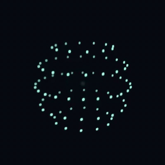
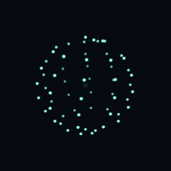
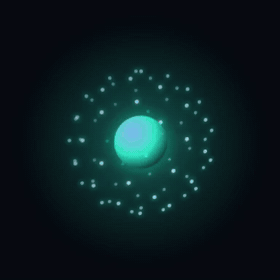
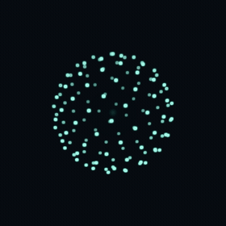
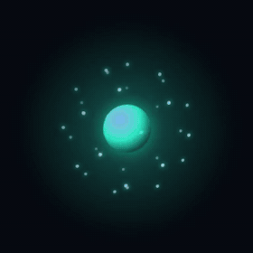
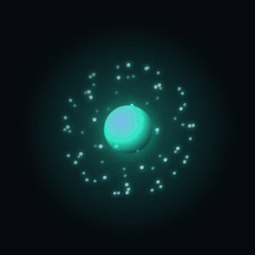
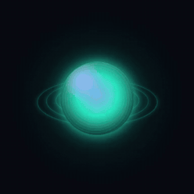
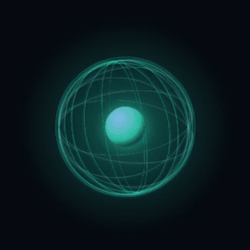
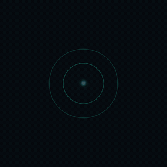
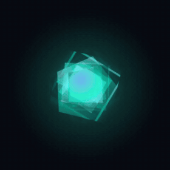

# Helixorb

[](LICENSE)

Open-source **pure CSS** presence orbs — particle shells, rings, meridians, ripples, facets. Four motion states, one attribute. No build, no CDN, no frameworks, no images.

Public entry: **`css/orbs.css`**. Every variant is **shell-first** (dots, rings, meridians, waves, or facets — not a bright core). Recommended: **`orb--lattice-orbit`** and **`orb--lattice-spiral`**.

Repo: [github.com/scottmtech/helixorb](https://github.com/scottmtech/helixorb). Class names (`orb`, `orb--lattice-orbit`, `data-state`, …) stay stable.

## Look

Recommended — shell-first particle clouds. GIFs are ~2.4s idle loops.

| `orb--lattice-orbit` | `orb--lattice-spiral` |
| :---: | :---: |
|  |  |

## Install

Copy `css/` into the project, or clone/vendor this repo, then link the bundle:

```html
<link rel="stylesheet" href="css/orbs.css">
```

That one file `@import`s tokens, the shared shell, and every variation. You can instead link `tokens.css` + `orb.css` + one variant file.

`js/orb.js` is **optional**. PHP in `snippets/orb.php` is an optional sample include.

## Markup + state

Paste a snippet from `snippets/` (start with `lattice-orbit.html` or `lattice-spiral.html`):

```html
<link rel="stylesheet" href="css/orbs.css">

<!-- snippets/lattice-orbit.html -->
<div class="orb orb--lattice-orbit" data-state="idle" role="img" aria-label="AI presence, idle">
  …
</div>
```

CSS reads **`data-state`** on `.orb`:

| Value | Feel |
| --- | --- |
| `idle` | Calm drift |
| `thinking` | Search / scan (orbit: latitude bands; spiral: helical tilt) |
| `listening` | Expand–contract |
| `talking` | Faster speaking cadence |
| `writing` | Alias of `talking` |

Every variant keeps states distinct through **motion**, not a brighter core.

## Change state (JS)

One line. No helper required:

```js
const orb = document.querySelector(".orb");
orb.dataset.state = "listening";
```

Optional helper (`js/orb.js`):

```js
Helixorb.setState(orb, "thinking");
Helixorb.setHue(orb, 272);
```

`MatrixOrb` is kept as an alias of `Helixorb` so existing demos keep working.

## Variants

| Orbit | Spiral | Lattice | Dense | Air |
| :---: | :---: | :---: | :---: | :---: |
|  |  |  |  |  |
| `orb--lattice-orbit` | `orb--lattice-spiral` | `orb--lattice` | `orb--lattice-dense` | `orb--lattice-air` |

| Nested | Soft | Wire | Ripple | Crystal |
| :---: | :---: | :---: | :---: | :---: |
|  |  |  |  |  |
| `orb--lattice-nested` | `orb--soft` | `orb--wire` | `orb--ripple` | `orb--crystal` |

| Class | Look | Snippet |
| --- | --- | --- |
| **`orb orb--lattice-orbit`** | **Latitude rings of dots (recommended)** | `snippets/lattice-orbit.html` |
| **`orb orb--lattice-spiral`** | **Helical scatter (recommended)** | `snippets/lattice-spiral.html` |
| `orb orb--lattice` | Baseline Fibonacci cloud | `snippets/lattice.html` |
| `orb orb--lattice-dense` | Packed cloud | `snippets/lattice-dense.html` |
| `orb orb--lattice-air` | Sparse constellation | `snippets/lattice-air.html` |
| `orb orb--lattice-nested` | Dual concentric shells | `snippets/lattice-nested.html` |
| `orb orb--soft` | Translucent sphere + rings | `snippets/soft.html` |
| `orb orb--wire` | Wireframe meridians | `snippets/wire.html` |
| `orb orb--ripple` | Pulse rings | `snippets/ripple.html` |
| `orb orb--crystal` | Faceted crystal | `snippets/crystal.html` |

## Theming

Set `--orb-hue` on the orb, a wrapper, or `:root`. Derived colors follow unless you override them.

```html
<div class="orb orb--lattice-orbit" data-state="idle" style="--orb-hue: 272;">
```

```html
<div class="orb orb--lattice-spiral" data-state="talking"
     style="--orb-color: #39ff88; --orb-color-secondary: #baffd9; --orb-size: 180px;">
```

| Token | Role | Default |
| --- | --- | --- |
| `--orb-hue` | Hue (0–360) when you do not set `--orb-color` | `168` |
| `--orb-color` | Primary stroke / fill | from hue |
| `--orb-color-secondary` | Highlights | from hue + 42 |
| `--orb-glow` | Soft bloom | mix of `--orb-color` |
| `--orb-size` | Width and height | `160px` |
| `--orb-bg` | Demo page background | `#070b10` |

`prefers-reduced-motion: reduce` stops looping animation.

## Demos

From the repo root:

```bash
python3 -m http.server 8080
```

| Page | What |
| --- | --- |
| [demos/standalone.html](demos/standalone.html) | Copy-paste happy path — orbit + spiral, `data-state` only |
| [demos/lattice-family.html](demos/lattice-family.html) | Particle-shell explorer (defaults to orbit) |
| [demos/index.html](demos/index.html) | Full gallery + live theme controls |
| [demos/php-example.php](demos/php-example.php) | Optional PHP include (`php -S localhost:8080`) |

`file://` works; a local server is nicer for relative CSS.

Query helpers (samples only): `standalone.html?state=listening`, `lattice-family.html?variant=lattice-spiral&state=thinking`.

## PHP sample (optional)

```php
<link rel="stylesheet" href="/css/orbs.css">
<?php
$orbVariant = 'lattice-orbit';
$orbState   = 'idle';
$orbHue     = 168;
include __DIR__ . '/snippets/orb.php';
?>
<script>
  document.querySelector(".orb").dataset.state = "talking";
</script>
```

## Layout

```
css/orbs.css                 public bundle (link this)
css/tokens.css               variables + state timing
css/orb.css                  shared shell, reduced-motion
css/orb-lattice.css          particle DNA + baseline lattice
css/orb-lattice-family.css   dense / air / nested / orbit / spiral
css/orb-soft.css
css/orb-wire.css
css/orb-ripple.css
css/orb-crystal.css
js/orb.js                    optional Helixorb helper (MatrixOrb alias)
snippets/*.html              copy-paste markup
snippets/orb.php             optional PHP include
docs/screenshots/            idle GIFs + PNG stills for this README
demos/                       samples, not required at runtime
```

## License

[MIT](LICENSE). `package.json` also declares `"license": "MIT"`.

## Contribute

Issues and PRs are welcome. See [CONTRIBUTING.md](CONTRIBUTING.md). Keep the drop-in API unchanged: `.orb` + variant class + `data-state`, and `css/orbs.css` as the public entry. Visual tweaks should stay shell-first (minimal core/halo; states via motion). No new runtime dependencies.
